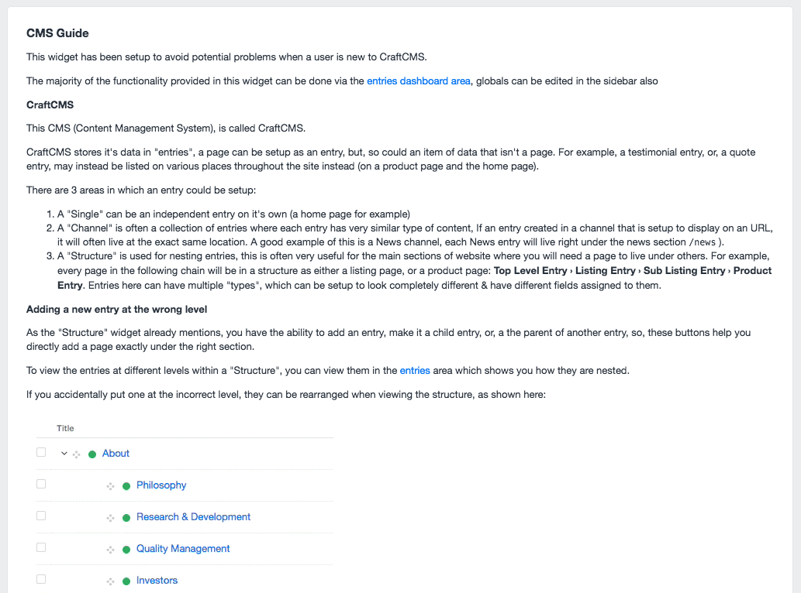
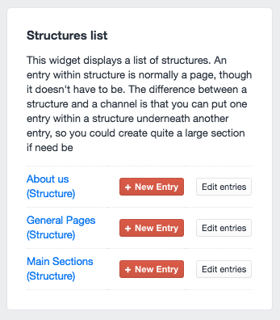
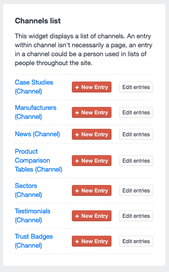
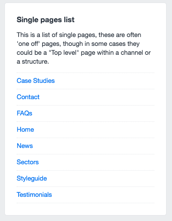

# Client Dashboard Widgets plugin for Craft CMS

A set of CraftCMS dashboard widgets that are useful for a client user.

## Client Dashboard Widgets Overview

While CraftCMS has one of the best backend interfaces I have seen, I still think that it's difficult for Craft users to get the concept quickly. I built these widgets to try and counter that.

If a site is has some complex areas, you may want to explain how it works in a widget, the CMS Guide widget can be edited in `clientdashboardwidgets/templates/_cmsguide.twig`.

As an example, I often create a "Company Information" global area, which contains meta data about the site, I often do my best to fill this in as best I can but best for the site's owner to check it over. I often leave a note like this:

>*IMPORTANT - Please check the content in this area is 100% correct otherwise Google may show incorrect data about your business in search results.*

I have added some commented our code examples of how to list globals, channels &amp; structures in this file, all you need is the correct id.

If you wish to add images to the widget, you can place the file in `clientdashboardwidgets/resources/site` then it can be reference like so:

``````

I have found the `max-width:100%` css is needed if you don't want it to overlap the widgets... There's probably some class I could use but no idea what that would be.

Tip: mp4s don't seem to work too well, though YouTube embeds can, though you may need a `max-width:100%` setting on the iframe element.

Feel free to suggest any amendments, create an issue or whatever...

## What does the plugin include?

### CMS Guide Widget



### Structure List Widget



### Channel List Widget



### Single Entries List Widget



## Installation

To install Client Dashboard Widgets, follow these steps:

1. Download & unzip the file and place the `clientdashboardwidgets` directory into your `craft/plugins` directory
2.  -OR- do a `git clone https://github.com/joepagan/clientdashboardwidgets.git` directly into your `craft/plugins` folder.  You can then update it with `git pull`
3.  -OR- install with Composer via `composer require joepagan/clientdashboardwidgets`
4. Install plugin in the Craft Control Panel under Settings > Plugins
5. The plugin folder should be named `clientdashboardwidgets` for Craft to see it.  GitHub recently started appending `-master` (the branch name) to the name of the folder for zip file downloads.

Client Dashboard Widgets works on Craft 2.4.x and Craft 2.5.x.

## Changelog

*06/07/2017*

    Plugin folder now at root level
    Removing twitter widget, who cares right?
    Removing tools widget, just go to tools
    Removing contact results widget, who uses that contact form anymore?
    Added new widget for CMS guide
    - adding brief descriptions of how craft works (singles, channels, structures)
    - adding commented out global examples (that could be used across all projects)
    - added commented out structure example
    - added new entry type gif

####mov -> gif conversion

For my own convenience, a little script I use for gifs which I will forget about.

    time ffmpeg -i  example.mov -r 10 -f image2pipe -vcodec ppm - |  time convert -verbose +dither -layers Optimize \> - gif:- | gifsicle --colors 128 --delay=5 --loop --optimize=3 --multifile ->  example.gif

Brought to you by [Joe Pagan](https://www.joe-pagan.com)
